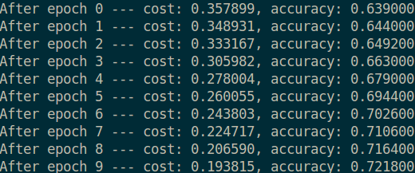

# tensorflow_siamese_lstm

This repo is for the implementation of the siamese lstm model by:  

<a href = "http://www.mit.edu/~jonasm/info/MuellerThyagarajan_AAAI16.pdf">Mueller, Jonas, and Aditya Thyagarajan. "Siamese Recurrent Architectures for Learning Sentence Similarity." AAAI. 2016.</a>

The code was from my previous attending of <a href="https://www.kaggle.com/c/quora-question-pairs">Kaggle Quora Pairs Competiton</a>

The model was implemented with Tensorflow(python) and will be tested with part of the data from the competition above

The structure of Siamese_LSTM is like

The left and right lstm shared commom parameters, which are used to extract features from the sequence of embedded text sentences.

The sample output from the test case with the model on the Kaggle Quora data is like

The model can be improved by adding the fully connected layers after the lstm siamese structure, change the form of loss function or using lstm with other strctures(deeper, bidirectional or tree-based structure)
